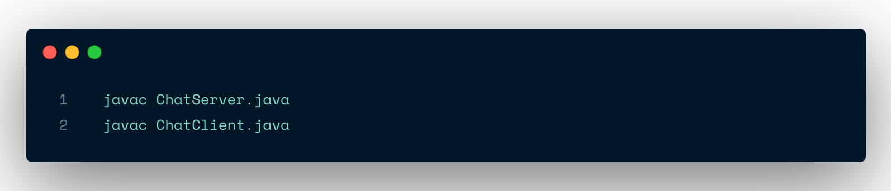
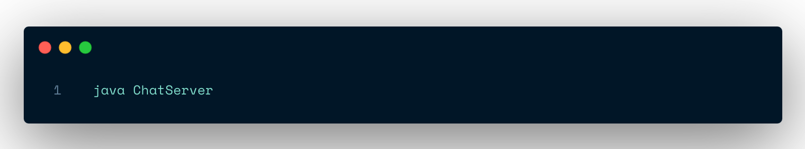

# Java Chat Application

This is a simple chat application implemented in Java, demonstrating basic socket programming and multithreading concepts.

## Files Included

- `ChatServer.java`: The server-side application that manages client connections and message broadcasting.
- `ChatClient.java`: The client-side application that connects to the server and allows users to send and receive messages.
- `screenshot.png`: A screenshot demonstrating the text-based user interface of the chat application.

## How to Run the Application

1. Compile both Java files:

2. Start the server:

3. In separate terminal windows, start multiple clients:

4. Once connected, you can start typing messages in the client windows. Press Enter to send a message.

5. To exit, close the terminal windows or use Ctrl+C.

## Implementation Details

- The server runs on localhost (127.0.0.1) and listens on port 5000.
- The server can handle multiple client connections concurrently using separate threads for each client.
- Each client is assigned a unique user ID upon connecting.
- Messages sent by a client are broadcast to all connected clients.
- The application uses a simple text-based interface for ease of use and demonstration purposes.

## Limitations and Potential Improvements

- The application doesn't handle server disconnections gracefully.
- There's no private messaging functionality.
- A graphical user interface could improve user experience.
- Adding user authentication and registration would enhance security and user management.
